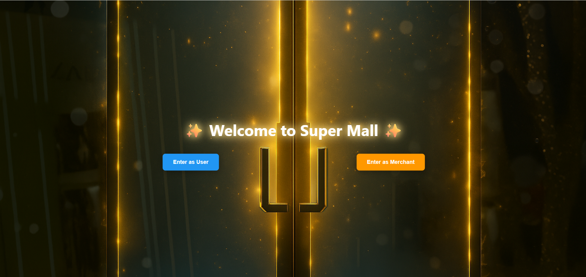
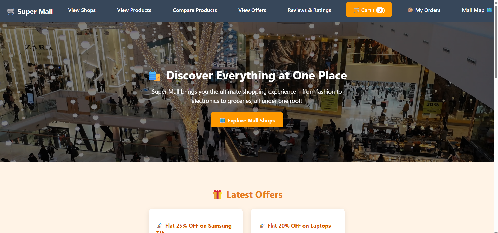
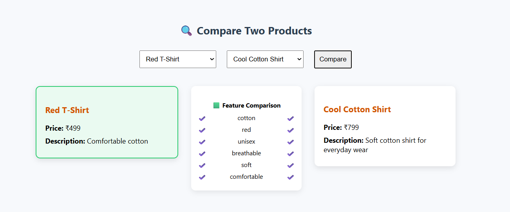
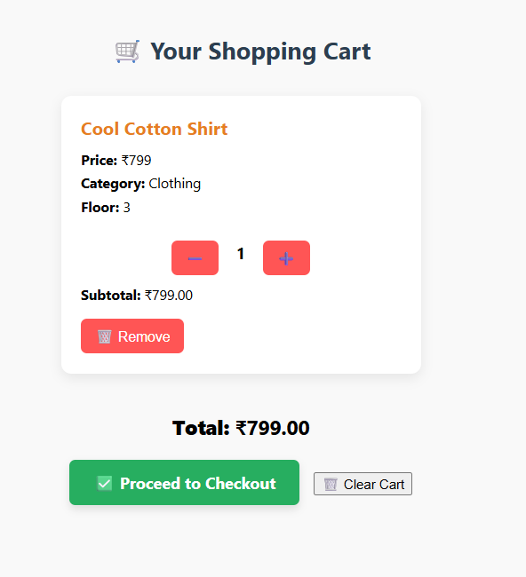
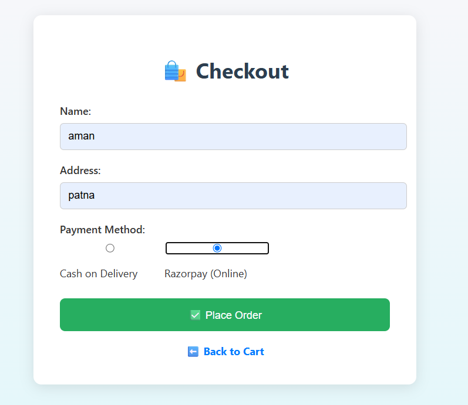

# 🏬 Super Mall Web Application

Hello! This is a fully working shopping mall website I built using **HTML**, **CSS**, **JavaScript**, and **Firebase**.

It’s designed like a real mall. People can explore shops by floor, view and compare products, add to cart, and place orders.  
Shop owners (merchants) can register their shop, add products, and manage offers. Everything runs in real-time using Firebase!

---

## 🌐 Live Demo

👉 **Visit Live Site**: [Super Mall is Live on Firebase! 🚀](https://supermallapp-439f7.web.app)

---

## 🌟 What Can You Do on Super Mall?

### 👤 As a User:

- Browse all shops grouped floor-wise (Floor 0 to Floor 10)  
- Filter products by **category** (like Food, Electronics) or **floor**  
- Compare two products side by side (price, features, image)  
- Add items to cart and checkout  
- Choose **Cash on Delivery** or simulated Razorpay/GPay  
- Track your order location on a map (📍Leaflet + OpenStreetMap)  
- Submit and view product **reviews and ratings**

### 🧑‍💼 As a Merchant:

- Sign up securely using Firebase Authentication  
- Register your shop with floor, name, and category  
- Add products (with image, price, floor, category, etc.)  
- Add special **offers** for your shop

---

## 🧱 Tech Stack I Used (Explained Simply)

🧑‍🎨 **Frontend:**  
I used HTML, CSS, and JavaScript to build the design and functionality. Simple, powerful, and under full control.

🔐 **Login System:**  
Firebase Authentication lets users and merchants log in securely — no backend needed.

📦 **Database:**  
Firebase Realtime DB stores products, shops, offers, orders, reviews — and updates instantly.

🗺️ **Map Integration:**  
Leaflet + OpenStreetMap (free & easy!) instead of Google Maps that asks for cards and APIs 😤  
*"Google: Add a card to continue..." Me: Bro I just want to show a map 😭"*

💳 **Payment System:**  
I wanted to use Razorpay, but they asked for a business certificate — I’m just a student!  
So I simulated payment with a popup instead 😂

🌐 **Testing:**  
I used Live Server in VS Code for fast reload and testing.

☁️ **Hosting:**  
Deployed on Firebase Hosting + GitHub Pages for showing it off online 😎

---

## 🔗 Firebase Structure I Designed

 /shops → All registered shops
 /products → Products added by merchants
 /offers → Offers by shop owners
 /orders → Orders placed by users
 /reviews → Reviews submitted by users

 
---

## ▶️ How to Run This Project

### 🧪 If You’re Testing Locally:

1. Open the folder in VS Code  
2. Right-click on `index.html` → **Open with Live Server**  
3. Make sure you're connected to the internet  
4. Explore the mall like a real shopper 😄  

### ☁️ If You’re Hosting Online:

**✅ GitHub Pages**  
- Push your project to a GitHub repo  
- Go to Settings → Pages → Set it to main branch  
- Access it from:  
  `https://yourusername.github.io/super-mall-app/`  

**✅ Firebase Hosting**  
- Initialize Firebase Hosting  
- Deploy with `firebase deploy`  
- Access it at:  
  `https://your-firebase-project.web.app`

---

## 🖼️ Screenshots

### 🚪entry to mall

### 🏠 Homepage with mall animation  

### 🔍 Product comparison view  

### 🛒 Add to cart   

### ✅ checkout

### 🗺️ Track order location on map  

---

## 🎯 What I Learned from This Project

- Using Firebase Realtime DB and Authentication  
- Integrating maps with Leaflet  
- Creating cart and review systems  
- Deploying a complete, working real-world app  

---

## 👨‍💻 Made by

**Chandan Kumar**  
Beginner web developer learning by building awesome real apps ❤️

---

## 💬 Bonus Tip (for reviewers)

> This project is responsive, runs fully in the browser, and uses Firebase to connect frontend and backend — great for beginner developers to learn from.

---

## 🔗 Project Links

- 🔥 Firebase Hosting: [https://supermallapp-439f7.web.app](https://supermallapp-439f7.web.app)
- 🗂️ GitHub Repo: [https://github.com/chndn-coder/super-mall-webapp]

